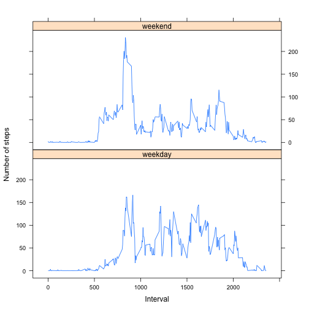

## Loading and preprocessing the data

```r
activity <- read.csv(unz("activity.zip", "activity.csv"))
activity_clean <- subset(activity, !is.na(steps))
steps_sum <- as.vector(t(subset(aggregate(.~date, data = activity_clean, sum), select = c("steps"))))
```

## What is mean total number of steps taken per day?

```r
hist(steps_sum, xlab = "Steps per day", main = "Total number of steps per day")
```

 

```r
mean(steps_sum)
```

```
## [1] 10766.19
```

```r
median(steps_sum)
```

```
## [1] 10765
```

## What is the average daily activity pattern?

```r
steps_mean <- subset(aggregate(.~interval, data = activity_clean, mean), select = c("steps", "interval"))
with(steps_mean, plot(interval, steps, type = "l", main = "Average daily activity", xlab = "Interval", ylab = "Average"))
```

 

```r
interval_max <- steps_mean[steps_mean$steps == max(steps_mean$steps),]
interval_max
```

```
##        steps interval
## 104 206.1698      835
```

## Imputing missing values

```r
sum(is.na(activity$steps))
```

```
## [1] 2304
```

```r
fix_activity <- activity
steps_mean_fix <- steps_mean 
gaps <- is.na(fix_activity$steps)
fix_activity$interval <- factor(fix_activity$interval)
steps_mean_fix$interval <- factor(steps_mean_fix$interval)
fix_activity[gaps, "steps"] <- steps_mean_fix[fix_activity[gaps, "interval"], "steps"]
steps_sum_fix <- as.vector(t(subset(aggregate(.~date, data = fix_activity, sum), select = c("steps"))))

hist(steps_sum, xlab = "Steps per day", main = "Total number of steps per day")
```

 

```r
mean(steps_sum_fix)
```

```
## [1] 10766.19
```

```r
median(steps_sum_fix)
```

```
## [1] 10766.19
```

## Are there differences in activity patterns between weekdays and weekends?

```r
wk <- fix_activity
wk$day_type <- factor(ifelse(!weekdays(as.Date(wk$date)) %in% c("Saturday", "Sunday"), "weekend", "weekday"))
multigroup <- aggregate(cbind(steps) ~ interval + day_type, wk, mean)
multigroup$interval <- as.numeric(as.character(multigroup$interval))

library(lattice)
xyplot(steps ~ interval | day_type, multigroup, type = "l", layout = c(1, 2), xlab = "Interval", ylab = "Number of steps")
```

 
